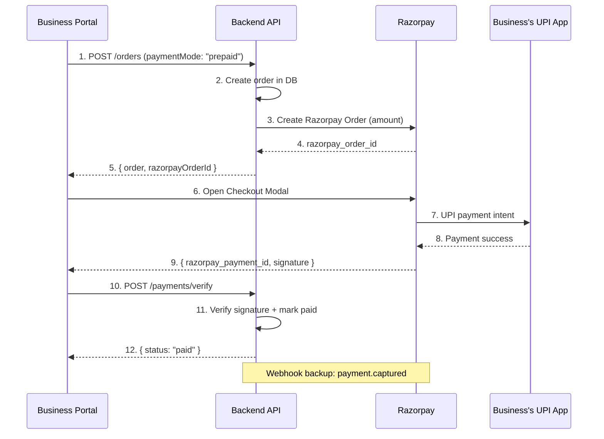
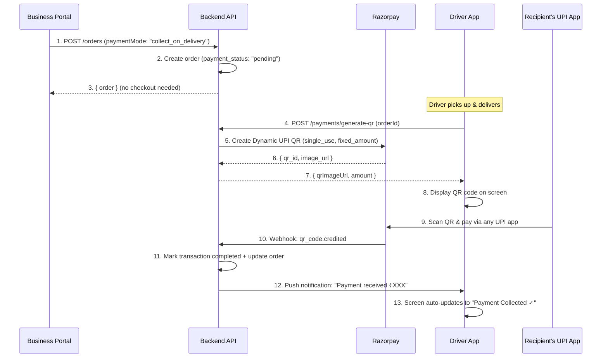
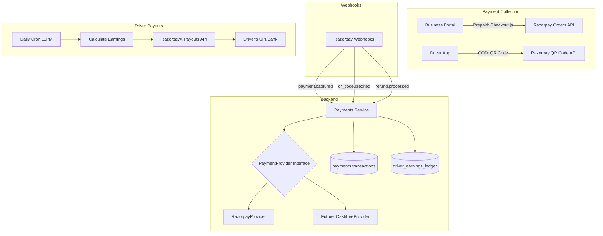

# Payment System Integration for Shipzy (Final)

## Context

Shipzy is a B2B delivery logistics platform (Mumbai, India) with:
- **Backend**: Node.js/Fastify + PostgreSQL (Drizzle ORM) — existing `payments` schema with `transactions`, `refunds`, `payment_methods` tables + SQL functions
- **Business Portal** (`apps/business`): Next.js — already has `paymentMethodId` in order creation flow
- **Driver App** (`apps/driver`): Flutter — has earnings/trips screens, no payment integration yet

---

## Decisions Locked In

| Decision | Choice |
|----------|--------|
| Payment methods | **UPI only** (0% MDR) |
| Payment modes | **Two modes**: Prepaid (business pays at order creation) + Collect-on-Delivery (driver collects UPI from recipient) |
| COD/Cash | **No** — all digital |
| Wallet/Prepaid balance | **No** |
| Collection method | **Razorpay Dynamic QR Code** — driver shows QR, recipient scans, auto-confirmed |
| Checkout (business) | **Razorpay Standard Checkout** (modal popup) |
| Transaction history | **Per-order** in order detail view |
| Driver payouts | **Daily batch settlement** via RazorpayX |
| Provider | **Razorpay** (0% UPI MDR, best ecosystem) |

---

## Two Payment Modes

### Mode 1: Prepaid (Business Pays at Order Creation)



**When**: Business selects "Prepaid" at order creation → pays immediately → order goes to `pending` for driver pickup.

---

### Mode 2: Collect-on-Delivery (Driver Collects UPI from Recipient)



**When**: Business selects "Collect on Delivery" at order creation → driver delivers → shows QR on phone → recipient scans with GPay/PhonePe/Paytm → auto-confirmed via Razorpay webhook.

> [!IMPORTANT]
> The Razorpay QR is a **single-use, fixed-amount** dynamic QR. The recipient cannot pay a different amount. The QR expires after a configurable window (e.g., 30 minutes). This is the same approach used by Swiggy/Dunzo for collect-on-delivery.

---

## Proposed Changes

### Architecture



---

### Backend — New Payment Module

#### [NEW] [payment-provider.interface.ts](file:///Users/arshnirmal/Desktop/arsh/Projects/Shipzy/backend/src/modules/payments/payment-provider.interface.ts)

Provider-agnostic interface (Strategy Pattern):

```typescript
interface PaymentProvider {
  readonly name: string;
  
  // Collection — Prepaid (business pays via checkout)
  createPaymentOrder(params: CreatePaymentOrderParams): Promise<PaymentOrderResult>;
  verifyPayment(params: VerifyPaymentParams): Promise<PaymentVerificationResult>;
  
  // Collection — Collect-on-Delivery (driver shows QR)
  generateQRCode(params: GenerateQRParams): Promise<QRCodeResult>;
  
  // Webhook handling
  handleWebhook(body: unknown, headers: Record<string, string>): Promise<WebhookResult>;
  
  // Refunds
  initiateRefund(params: RefundParams): Promise<RefundResult>;
  
  // Payouts (Shipzy → Driver)
  initiatePayout(params: PayoutParams): Promise<PayoutResult>;
  batchPayout(params: BatchPayoutParams): Promise<BatchPayoutResult>;
  getPayoutStatus(payoutId: string): Promise<PayoutStatusResult>;
}
```

#### [NEW] [providers/razorpay.provider.ts](file:///Users/arshnirmal/Desktop/arsh/Projects/Shipzy/backend/src/modules/payments/providers/razorpay.provider.ts)

Razorpay implementation with three capabilities:

1. **Orders API** — `razorpay.orders.create()` for prepaid checkout
2. **QR Code API** — `razorpay.qrCode.create({ type: "upi_qr", usage: "single_use", fixed_amount: true })` for collect-on-delivery
3. **Payouts API** — RazorpayX `POST /payouts` for driver settlements

Webhook handling:
- `payment.captured` → prepaid order confirmed
- `qr_code.credited` → collect-on-delivery payment received
- `refund.processed` → refund completed

#### [NEW] [provider-factory.ts](file:///Users/arshnirmal/Desktop/arsh/Projects/Shipzy/backend/src/modules/payments/provider-factory.ts)

Maps payment method → provider. For MVP, all methods route to Razorpay singleton.

#### [NEW] [payments.service.ts](file:///Users/arshnirmal/Desktop/arsh/Projects/Shipzy/backend/src/modules/payments/payments.service.ts)

Orchestration layer — 5 core flows:

1. **`initiatePayment(orderId, amount)`** — For prepaid: creates Razorpay order + DB transaction row
2. **`verifyPayment(razorpayOrderId, paymentId, signature)`** — Verifies prepaid payment + marks complete
3. **`generateCollectionQR(orderId)`** — For collect-on-delivery: creates dynamic UPI QR via Razorpay
4. **`processWebhook(body, headers)`** — Idempotent webhook handler for both `payment.captured` and `qr_code.credited`
5. **`processDailyPayouts()`** — Calculates driver earnings, initiates batch UPI payout via RazorpayX

#### [NEW] [payments.controller.ts](file:///Users/arshnirmal/Desktop/arsh/Projects/Shipzy/backend/src/modules/payments/payments.controller.ts)

| Method | Route | Auth | Purpose |
|--------|-------|------|---------|
| `POST` | `/payments/create-order` | Business | Create Razorpay order for prepaid |
| `POST` | `/payments/verify` | Business | Verify prepaid payment after checkout |
| `POST` | `/payments/generate-qr` | Driver | Generate UPI QR for collect-on-delivery |
| `GET` | `/payments/qr/:orderId/status` | Driver | Poll QR payment status (backup to push) |
| `POST` | `/payments/webhook/razorpay` | None (signature-verified) | Razorpay webhook receiver |
| `GET` | `/payments/order/:orderId/status` | Business/Driver | Get payment status for an order |
| `POST` | `/payments/:transactionId/refund` | Admin | Initiate refund |
| `GET` | `/payments/driver/earnings` | Driver | Get driver's earnings summary |
| `GET` | `/payments/driver/payouts` | Driver | Get driver's payout history |

#### [NEW] [payments.routes.ts](file:///Users/arshnirmal/Desktop/arsh/Projects/Shipzy/backend/src/modules/payments/payments.routes.ts)
#### [NEW] [payments.schema.ts](file:///Users/arshnirmal/Desktop/arsh/Projects/Shipzy/backend/src/modules/payments/payments.schema.ts)
#### [NEW] [payments.zod.ts](file:///Users/arshnirmal/Desktop/arsh/Projects/Shipzy/backend/src/modules/payments/payments.zod.ts)

Standard module structure following existing [orders module](file:///Users/arshnirmal/Desktop/arsh/Projects/Shipzy/backend/src/modules/orders) patterns.

#### [NEW] [payout.scheduler.ts](file:///Users/arshnirmal/Desktop/arsh/Projects/Shipzy/backend/src/modules/payments/payout.scheduler.ts)

Daily payout cron job (11 PM IST):
- Queries `driver_earnings_ledger` for unsettled earnings
- Groups by driver, deducts platform commission
- Calls RazorpayX batch payout API (UPI transfer to driver)
- Records payout in `driver_payouts` table
- Uses existing [scheduler.ts](file:///Users/arshnirmal/Desktop/arsh/Projects/Shipzy/backend/src/utils/scheduler.ts) pattern

---

### Backend — Database Changes

#### [MODIFY] [public.ts](file:///Users/arshnirmal/Desktop/arsh/Projects/Shipzy/backend/src/database/schema/public.ts)

Add new enums:
```typescript
export const paymentModeEnum = pgEnum("payment_mode", ["prepaid", "collect_on_delivery"]);
export const payoutStatusEnum = pgEnum("payout_status", ["pending", "processing", "completed", "failed"]);
export const earningsStatusEnum = pgEnum("earnings_status", ["pending", "settled", "failed"]);
```

#### [MODIFY] [payments.ts](file:///Users/arshnirmal/Desktop/arsh/Projects/Shipzy/backend/src/database/schema/payments.ts)

Add two new tables:

**`driver_earnings_ledger`** — tracks per-delivery earnings before settlement:

| Column | Type | Description |
|--------|------|-------------|
| `ledger_id` | SERIAL PK | |
| `driver_id` | INT FK → users | |
| `order_id` | INT FK → orders | |
| `assignment_id` | INT FK → assignments | |
| `gross_amount` | NUMERIC(10,2) | Full delivery fee |
| `commission_pct` | NUMERIC(5,2) | Platform cut % |
| `commission_amt` | NUMERIC(10,2) | Platform cut ₹ |
| `net_amount` | NUMERIC(10,2) | What driver receives |
| `status` | earnings_status | pending / settled / failed |
| `payout_id` | INT FK → payouts | Set when settled |
| `earned_at` | TIMESTAMPTZ | When delivery completed |

**`driver_payouts`** — tracks daily batch settlements:

| Column | Type | Description |
|--------|------|-------------|
| `payout_id` | SERIAL PK | |
| `driver_id` | INT FK → users | |
| `total_deliveries` | INT | Count for this payout |
| `gross_amount` | NUMERIC(10,2) | Total before commission |
| `total_commission` | NUMERIC(10,2) | Platform's cut |
| `net_amount` | NUMERIC(10,2) | Sent to driver |
| `payout_method` | VARCHAR(20) | "upi" / "bank_transfer" |
| `payout_upi_id` | VARCHAR(100) | Driver's UPI VPA |
| `external_payout_id` | VARCHAR(255) | RazorpayX payout ID |
| `status` | payout_status | pending / processing / completed / failed |
| `failure_reason` | TEXT | |
| `payout_date` | DATE | The business day being settled |

#### [MODIFY] [orders.ts](file:///Users/arshnirmal/Desktop/arsh/Projects/Shipzy/backend/src/database/schema/orders.ts)

Add `payment_mode` column to `order_requests` table:
```typescript
paymentMode: paymentModeEnum("payment_mode").notNull().default("prepaid"),
```

#### [MODIFY] [payments.ts](file:///Users/arshnirmal/Desktop/arsh/Projects/Shipzy/backend/src/database/schema/payments.ts) (existing `transactions` table)

Add QR-related columns to `transactions`:
```typescript
qrCodeId: varchar("qr_code_id", { length: 255 }),      // Razorpay QR ID
qrImageUrl: varchar("qr_image_url", { length: 500 }),   // QR image URL for driver app
qrExpiresAt: timestamp("qr_expires_at", { withTimezone: true }), // QR expiry
```

---

### Backend — Existing File Modifications

#### [MODIFY] [env.ts](file:///Users/arshnirmal/Desktop/arsh/Projects/Shipzy/backend/src/config/env.ts)

Add environment variables:
```
RAZORPAY_KEY_ID           # rzp_test_xxx (test) or rzp_live_xxx (prod)
RAZORPAY_KEY_SECRET       # Key secret
RAZORPAY_WEBHOOK_SECRET   # Webhook signing secret
RAZORPAY_ACCOUNT_NUMBER   # For RazorpayX payouts
DRIVER_COMMISSION_PCT     # Default: 15 (platform takes 15%)
PAYOUT_SCHEDULE_HOUR      # Default: 23 (11 PM IST)
QR_EXPIRY_MINUTES         # Default: 30 (QR expires in 30 mins)
```

#### [MODIFY] [app.ts](file:///Users/arshnirmal/Desktop/arsh/Projects/Shipzy/backend/src/app.ts)

Register `/payments` route module + payout scheduler.

#### [MODIFY] [orders.service.ts](file:///Users/arshnirmal/Desktop/arsh/Projects/Shipzy/backend/src/modules/orders/orders.service.ts)

Three integration points:

1. **`createOrder()`** — If `paymentMode === "prepaid"`: create Razorpay order, return `razorpayOrderId`. If `paymentMode === "collect_on_delivery"`: create order with `payment_status: "pending"`, no checkout needed.

2. **`updateOrderStatus()` → on `delivered`** — Create `driver_earnings_ledger` entry (delivery fee minus commission).

3. **`submitProofOfDelivery()`** — For collect-on-delivery: require payment to be completed before allowing proof submission (or make it a soft requirement with warning).

#### [MODIFY] [orders.zod.ts](file:///Users/arshnirmal/Desktop/arsh/Projects/Shipzy/backend/src/modules/orders/orders.zod.ts)

Add fields:
- `paymentMode` to `CreateOrderRequest` (`"prepaid" | "collect_on_delivery"`)
- `razorpayOrderId` and `paymentStatus` to `CreateOrderResponse`
- `paymentInfo` section to `OrderDetails`

#### [MODIFY] [payments.queries.ts](file:///Users/arshnirmal/Desktop/arsh/Projects/Shipzy/backend/src/database/queries/payments.queries.ts)

Add queries for:
- Driver earnings ledger CRUD
- Driver payouts CRUD
- Earnings summary (total/pending/settled)
- QR code tracking (store/retrieve QR info)

#### [NEW] [payments.sql](file:///Users/arshnirmal/Desktop/arsh/Projects/Shipzy/backend/src/database/functions/payments.sql) — extend

Add functions:
- `payments_create_earnings_entry` — insert ledger row on delivery completion
- `payments_get_unsettled_earnings` — query for daily payout batch
- `payments_settle_earnings_batch` — mark ledger entries as settled

---

### Business Portal (Next.js)

#### [NEW] [use-payment.ts](file:///Users/arshnirmal/Desktop/arsh/Projects/Shipzy/apps/business/src/hooks/use-payment.ts)

React hook for prepaid checkout flow:
```typescript
function usePayment() {
  // 1. Dynamically load Razorpay Checkout.js
  // 2. openCheckout({ razorpayOrderId, amount, orderId, prefill })
  //    → Opens modal → UPI payment → success/failure callback
  // 3. On success: POST /payments/verify → returns verified status
  // 4. On failure: show retry option
}
```

#### [MODIFY] [use-create-order.ts](file:///Users/arshnirmal/Desktop/arsh/Projects/Shipzy/apps/business/src/hooks/use-create-order.ts)

Updated flow based on payment mode:
- **Prepaid**: Create order → open Razorpay Checkout → verify → done
- **Collect-on-delivery**: Create order → done (no checkout, payment happens at delivery)

#### [MODIFY] [fulfillment-step.tsx](file:///Users/arshnirmal/Desktop/arsh/Projects/Shipzy/apps/business/src/components/drafts/steps/fulfillment-step.tsx)

Replace `paymentMethodId` dropdown with **payment mode selector**:
- Toggle/radio between "Prepaid (Pay Now)" and "Collect on Delivery"
- Clear visual distinction with icons

#### [MODIFY] [order-detail-view.tsx](file:///Users/arshnirmal/Desktop/arsh/Projects/Shipzy/apps/business/src/components/orders/order-detail-view.tsx)

Add "Payment Information" section:
- Payment mode (Prepaid / Collect on Delivery)
- Payment status badge
- Transaction ID (when paid)
- Paid at timestamp
- "Retry Payment" button (for failed prepaid)

#### [NEW] [payment-status-badge.tsx](file:///Users/arshnirmal/Desktop/arsh/Projects/Shipzy/apps/business/src/components/orders/payment-status-badge.tsx)

Reusable badge: `Pending` (amber) | `Paid` (green) | `Failed` (red) | `Refunded` (blue)

#### [MODIFY] Order list items

Small payment status dot/badge on each order card.

---

### Driver App (Flutter)

#### [NEW] [payment_models.dart](file:///Users/arshnirmal/Desktop/arsh/Projects/Shipzy/apps/driver/lib/models/payment_models.dart)

Freezed models:
- `PaymentQRCode` — `{ qrId, imageUrl, amount, expiresAt, status }`
- `EarningsLedgerEntry` — `{ orderId, grossAmount, commission, netAmount, earnedAt, status }`
- `PayoutRecord` — `{ payoutId, date, totalDeliveries, netAmount, status }`

#### [NEW] [payment_provider.dart](file:///Users/arshnirmal/Desktop/arsh/Projects/Shipzy/apps/driver/lib/providers/payment_provider.dart)

Riverpod providers:
- `driverEarningsProvider` — today's earnings summary
- `payoutHistoryProvider` — past payout records
- `qrCodeProvider(orderId)` — generate/get QR code for collection
- `pendingSettlementProvider` — amount waiting for tonight's payout

#### [MODIFY] [api_service.dart](file:///Users/arshnirmal/Desktop/arsh/Projects/Shipzy/apps/driver/lib/services/api_service.dart)

Add API methods:
- `generateCollectionQR(orderId)` → returns QR image URL + amount
- `getQRPaymentStatus(orderId)` → poll payment status (backup to push)
- `getDriverEarnings(period)` → earnings summary
- `getPayoutHistory(page, limit)` → paginated payout records

#### [MODIFY] [active_delivery_screen.dart](file:///Users/arshnirmal/Desktop/arsh/Projects/Shipzy/apps/driver/lib/screens/delivery/active_delivery_screen.dart)

Two flows based on payment mode:

**Prepaid orders**: Show "Prepaid ✓" green badge — no collection needed.

**Collect-on-delivery orders**: 
1. Show "Collect ₹XXX" badge (amber) during delivery
2. At delivery point: "Generate QR Code" button
3. Full-screen QR display with amount overlay (₹XXX)
4. Real-time status: "Waiting for payment..." with animated indicator
5. Auto-updates to "Payment Received ✓" via push notification / polling
6. Only then allow marking delivery as complete

#### [MODIFY] [earnings_screen.dart](file:///Users/arshnirmal/Desktop/arsh/Projects/Shipzy/apps/driver/lib/screens/earnings/earnings_screen.dart)

Enhanced earnings screen:
- **Today's Earnings**: Real-time total from completed deliveries
- **Pending Settlement**: Amount waiting for tonight's payout
- **Last Payout**: Amount + date of most recent settlement
- **Payout History**: Scrollable list of past daily settlements with status

#### [MODIFY] [order_types.dart](file:///Users/arshnirmal/Desktop/arsh/Projects/Shipzy/apps/driver/lib/models/order_types.dart)

Add payment fields:
```dart
String? paymentMode;     // "prepaid", "collect_on_delivery"
String? paymentStatus;   // "pending", "completed", "failed"
double? collectionAmount; // Amount to collect for collect_on_delivery
```

#### [MODIFY] [home_screen.dart](file:///Users/arshnirmal/Desktop/arsh/Projects/Shipzy/apps/driver/lib/screens/home/home_screen.dart)

Add "Today's Earnings" card on home screen.

---

## Razorpay Account Setup

1. **Sign up** at [dashboard.razorpay.com](https://dashboard.razorpay.com) — free, instant
2. **Test Mode** enabled by default — `rzp_test_xxx` keys available immediately
3. **Enable QR Codes**: Dashboard → Settings → Products → QR Codes
4. **Enable RazorpayX**: Dashboard → Settings → Products → RazorpayX (for payouts)
5. **Webhook setup**: Dashboard → Settings → Webhooks → Add URL
   - Events: `payment.captured`, `payment.failed`, `qr_code.credited`, `refund.processed`
6. **Test UPI VPAs**: `success@razorpay` (succeeds) and `failure@razorpay` (fails)
7. **Go Live**: Complete KYC (PAN, GST, bank details) when ready for production

---

## Phased Rollout

### Phase 1 — MVP (This Sprint) 🎯
1. Backend: Payment module with Strategy Pattern + Razorpay provider
2. Backend: Prepaid flow (Razorpay Orders API + verification)
3. Backend: Collect-on-delivery flow (Razorpay QR Code API + webhook)
4. Backend: Driver earnings ledger + daily payout scheduler
5. Backend: Webhook handler (payment.captured + qr_code.credited)
6. Business Portal: Payment mode selector in order creation
7. Business Portal: Razorpay Checkout integration for prepaid
8. Business Portal: Payment info in order details
9. Driver App: QR code generation + display for collect-on-delivery
10. Driver App: Payment status badges (Prepaid ✓ / Collect ₹XXX)
11. Driver App: Earnings screen + payout history

### Phase 2 — Enhancement (Future)
- Add Card/Net Banking methods (just enable in Razorpay)
- Payment retry flow with reminders
- Partial refund support
- Per-delivery instant payout (premium feature)
- Payment analytics in admin panel

### Phase 3 — Scale (Future)
- Add Cashfree as alternative provider (implement `PaymentProvider` interface)
- Subscription billing for business plans
- Auto-reconciliation reports

---

## Verification Plan

### Automated Tests
```bash
cd backend && npm test                          # No regressions
npm test -- --testPathPattern=payments          # New payment tests
```

### Manual Verification

| Scenario | Steps | Expected |
|----------|-------|----------|
| **Prepaid happy path** | Create order (prepaid) → Checkout → UPI `success@razorpay` | Order shows "Paid", transaction recorded |
| **Prepaid failure** | Create order → Cancel checkout | Order stays "Pending", retry available |
| **Collect-on-delivery** | Create order (COD) → Driver taps "Generate QR" → Simulated scan | QR displayed, webhook fires, payment confirmed |
| **QR expiry** | Generate QR → wait for expiry | QR shows expired, "Regenerate" button available |
| **Webhook idempotency** | Send same webhook twice | Only one transaction update, no duplicates |
| **Driver earnings** | Complete 3 deliveries | Earnings screen shows correct totals |
| **Daily payout** | Trigger payout scheduler manually | Payout record created, RazorpayX API called |
| **Refund** | Admin cancels prepaid order | Refund initiated via Razorpay API |

### Dependencies

| Package | Where | Purpose |
|---------|-------|---------|
| `razorpay` | Backend (npm) | Razorpay Node.js SDK — orders, payments, QR codes, refunds |
| RazorpayX API | Backend (REST) | Driver payouts |
| Razorpay Checkout.js | Business Portal (CDN) | Browser-side UPI checkout modal |
| `razorpay_flutter` | Driver App (pub) | **Not needed** — QR is just an image URL displayed in a widget |
