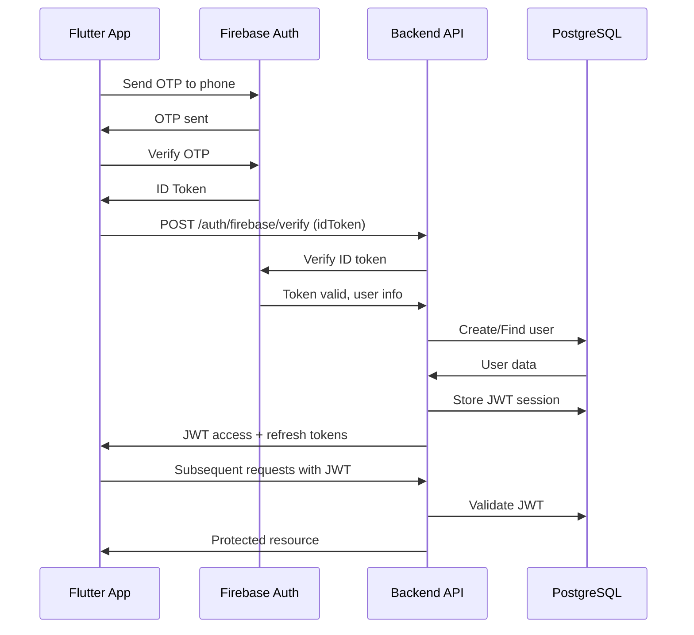

# 🚚 Shipzy Backend

> Production-ready backend API for the Shipzy hyperlocal delivery platform

[](https://nodejs.org/)
[](https://www.fastify.io/)
[](https://www.postgresql.org/)
[](https://firebase.google.com/)

---

## 📋 Overview

Shipzy Backend is a high-performance REST API built with Fastify, Firebase Authentication, and PostgreSQL. It powers a hyperlocal delivery platform connecting customers with nearby couriers.

### Key Features

- ✅ **Firebase Phone Authentication** (OTP-based)
- ✅ **JWT Token Management** with refresh tokens
- ✅ **Role-Based Access Control** (Client, Courier, Admin)
- ✅ **PostgreSQL Database** with PostGIS for geospatial queries
- ✅ **Real-time Tracking** (WebSocket support ready)
- ✅ **Secure & Scalable** architecture
- ✅ **Comprehensive Error Handling**
- ✅ **Rate Limiting** & Security Headers
- ✅ **Structured Logging** with Pino

---

## 🚀 Quick Start

### Prerequisites

- Node.js >= 18.0.0
- PostgreSQL 14+
- Firebase project
- npm or yarn

### Installation

```bash
# 1. Clone and navigate
cd services/backend

# 2. Install dependencies
npm install

# 3. Configure environment
cp .env.example .env
# Edit .env with your credentials (see .env.example for all required variables)

# 4. Setup database
psql -U postgres -f src/database/init/schema.sql

# 5. Start server
npm run dev
```

**👉 See [QUICKSTART.md](./QUICKSTART.md) for detailed setup**

**👉 See [FIREBASE_AUTH_SETUP.md](./FIREBASE_AUTH_SETUP.md) for Firebase configuration**

---

## 📂 Project Structure

```
services/backend/
├── src/
│   ├── config/                 # Configuration
│   │   ├── env.js             # Environment variables
│   │   ├── firebase.js        # Firebase Admin SDK
│   │   └── logger.js          # Pino logger
│   │
│   ├── utils/                  # Utilities
│   │   ├── jwt.util.js        # JWT generation/verification
│   │   ├── response.util.js   # Standard responses
│   │   └── error.util.js      # Custom error classes
│   │
│   ├── middleware/             # Middleware
│   │   ├── auth.middleware.js # JWT authentication
│   │   ├── error.middleware.js# Global error handler
│   │   └── validate.middleware.js # Request validation
│   │
│   ├── database/               # Database
│   │   ├── db.js              # Connection pool
│   │   ├── transaction.js     # Transaction helper
│   │   ├── init/              # Schema & migrations
│   │   └── queries/           # SQL queries
│   │       ├── auth.queries.js
│   │       ├── orders.queries.js
│   │       ├── drivers.queries.js
│   │       └── ...
│   │
│   ├── modules/                # Feature modules
│   │   └── auth/              # Authentication module
│   │       ├── auth.routes.js    # Routes
│   │       ├── auth.controller.js # Controllers
│   │       ├── auth.service.js   # Business logic
│   │       ├── auth.repository.js # Data access
│   │       └── auth.schema.js    # Validation schemas
│   │
│   ├── app.js                  # Fastify app
│   └── server.js               # Server entry point
│
├── package.json
├── .env.example
├── QUICKSTART.md
├── FIREBASE_AUTH_SETUP.md
└── README.md
```

---

## 🛠️ Tech Stack

| Category           | Technology                  |
| ------------------ | --------------------------- |
| **Runtime**        | Node.js 18+                 |
| **Framework**      | Fastify 4.28                |
| **Database**       | PostgreSQL 14+ with PostGIS |
| **Authentication** | Firebase Auth + JWT         |
| **Logger**         | Pino                        |
| **Validation**     | AJV                         |
| **Security**       | Helmet, CORS, Rate Limiting |

---

## 📡 API Endpoints

### Authentication

| Method | Endpoint                       | Description                     | Auth Required |
| ------ | ------------------------------ | ------------------------------- | ------------- |
| POST   | `/api/v1/auth/firebase/verify` | Login/Register with phone (OTP) | No            |
| POST   | `/api/v1/auth/google/verify`   | Login/Register with Google      | No            |
| POST   | `/api/v1/auth/refresh`         | Refresh JWT token               | No            |
| POST   | `/api/v1/auth/logout`          | Logout (revoke token)           | Yes           |

### User Management

| Method | Endpoint                         | Description              | Auth Required |
| ------ | -------------------------------- | ------------------------ | ------------- |
| GET    | `/api/v1/users/me`               | Get current user profile | Yes           |
| PUT    | `/api/v1/users/me`               | Update user profile      | Yes           |
| GET    | `/api/v1/users/me/addresses`     | Get saved addresses      | Yes           |
| POST   | `/api/v1/users/me/addresses`     | Save new address         | Yes           |
| DELETE | `/api/v1/users/me/addresses/:id` | Delete saved address     | Yes           |

### Driver Management

| Method | Endpoint                          | Description             | Auth Required |
| ------ | --------------------------------- | ----------------------- | ------------- |
| GET    | `/api/v1/drivers/me`              | Get driver profile      | Yes (Courier) |
| PUT    | `/api/v1/drivers/me`              | Update driver profile   | Yes (Courier) |
| PUT    | `/api/v1/drivers/me/availability` | Toggle availability     | Yes (Courier) |
| PUT    | `/api/v1/drivers/me/location`     | Update current location | Yes (Courier) |
| GET    | `/api/v1/drivers/me/assignments`  | Get active assignments  | Yes (Courier) |
| GET    | `/api/v1/drivers/me/earnings`     | Get earnings summary    | Yes (Courier) |

### Order Management

| Method | Endpoint                        | Description             | Auth Required |
| ------ | ------------------------------- | ----------------------- | ------------- |
| POST   | `/api/v1/orders/calculate-fare` | Calculate fare estimate | Yes           |
| POST   | `/api/v1/orders`                | Create new order        | Yes (Client)  |
| GET    | `/api/v1/orders`                | List user's orders      | Yes (Client)  |
| GET    | `/api/v1/orders/available`      | List available orders   | Yes (Courier) |
| GET    | `/api/v1/orders/:id`            | Get order details       | Yes           |
| POST   | `/api/v1/orders/:id/cancel`     | Cancel order            | Yes           |
| POST   | `/api/v1/orders/:id/accept`     | Driver accepts order    | Yes (Courier) |
| PUT    | `/api/v1/orders/:id/status`     | Update order status     | Yes (Courier) |

### Address & Location

| Method | Endpoint                            | Description                            | Auth Required |
| ------ | ----------------------------------- | -------------------------------------- | ------------- |
| POST   | `/api/v1/addresses/search`          | Search places (step 1)                 | Yes           |
| POST   | `/api/v1/addresses/retrieve`        | Get place details (step 2)             | Yes           |
| POST   | `/api/v1/addresses/reverse-geocode` | Reverse geocode coordinates            | Yes           |
| POST   | `/api/v1/addresses/directions`      | Get directions between points          | Yes           |
| POST   | `/api/v1/addresses/distance`        | Calculate distance between coordinates | Yes           |

### Static Data

| Method | Endpoint                            | Description            | Auth Required |
| ------ | ----------------------------------- | ---------------------- | ------------- |
| GET    | `/api/v1/static/delivery-types`     | Get delivery types     | No            |
| GET    | `/api/v1/static/weight-tiers`       | Get weight tiers       | No            |
| GET    | `/api/v1/static/vehicle-categories` | Get vehicle categories | No            |
| GET    | `/api/v1/static/package-types`      | Get package types      | No            |
| GET    | `/api/v1/static/payment-methods`    | Get payment methods    | No            |
| GET    | `/api/v1/static/create-order-data`  | Get create order data  | No            |
| GET    | `/api/v1/static/order-statuses`     | Get order statuses     | No            |

### Health Check

| Method | Endpoint  | Description          | Auth Required |
| ------ | --------- | -------------------- | ------------- |
| GET    | `/health` | Server health status | No            |
| GET    | `/api/v1` | API info             | No            |

**📋 Total: 30 implemented endpoints**

---

## 🔐 Authentication Flow



---

## 🔧 Environment Variables

| Variable                 | Description                    | Example                      |
| ------------------------ | ------------------------------ | ---------------------------- |
| `NODE_ENV`               | Environment                    | `development`                |
| `BACKEND_PORT`           | Server port                    | `3000`                       |
| `BACKEND_HOST`           | Server host                    | `0.0.0.0`                    |
| `POSTGRES_DB`            | Database name                  | `shipzy_dev`                 |
| `POSTGRES_USER`          | Database user                  | `shipzy_user`                |
| `POSTGRES_PASSWORD`      | Database password              | `secure_password`            |
| `DB_HOST`                | Database host                  | `localhost`                  |
| `DB_NAME`                | Database name                  | `shipzy_dev`                 |
| `DB_USER`                | Database user                  | `shipzy_user`                |
| `DB_PASSWORD`            | Database password              | `secure_password`            |
| `DB_PORT`                | Database port                  | `5432`                       |
| `DB_POOL_MAX`            | Database connection pool size  | `20`                         |
| `JWT_SECRET`             | JWT signing key                | (generate with openssl)      |
| `JWT_EXPIRES_IN`         | JWT expiration time            | `7d`                         |
| `JWT_REFRESH_EXPIRES_IN` | JWT refresh token expiration   | `30d`                        |
| `CORS_ORIGIN`            | CORS allowed origins           | `http://localhost:3000`      |
| `RATE_LIMIT_MAX`         | Rate limiting max requests     | `100`                        |
| `RATE_LIMIT_TIMEWINDOW`  | Rate limiting time window (ms) | `60000`                      |
| `LOG_LEVEL`              | Logging level                  | `info`                       |
| `LOG_QUERIES`            | Enable query logging           | `true`                       |
| `NGROK_AUTHTOKEN`        | ngrok auth token               | From ngrok dashboard         |
| `NGROK_DOMAIN`           | ngrok domain                   | `your-domain.ngrok-free.app` |

**Note:** Firebase authentication is now handled via the service account key file (`shipzy-37e1c-firebase-adminsdk-fbsvc-e2f198175a.json`) rather than environment variables.

**See [.env.example](./.env.example) for complete list**

---

## 🧪 Testing

Shipzy Backend includes comprehensive test coverage with 100+ test cases covering all API endpoints, authentication, authorization, and database operations.

### Available Test Scripts

```bash
# Run all tests with coverage
npm test

# Run tests in watch mode (development)
npm run test:watch

# Run comprehensive test suite
npm run test:all

# Run specific test modules
npm run test:auth        # Authentication tests
npm run test:users       # User management tests
npm run test:drivers     # Driver management tests
npm run test:orders      # Order management tests
npm run test:static      # Static data tests
npm run test:system      # Health check & system tests

# Generate detailed coverage report
npm run test:coverage

# Setup/cleanup test database
npm run test:db:setup
npm run test:db:cleanup

# Lint and format test files
npm run lint:test
npm run format:test
```

### Test Coverage

- ✅ **Authentication & Authorization** (Firebase, JWT, Role-based access)
- ✅ **User Management** (Profiles, addresses, validation)
- ✅ **Driver Management** (Availability, location, earnings, assignments)
- ✅ **Order Management** (Creation, status updates, cancellation, acceptance)
- ✅ **Static Data** (Delivery types, vehicle categories, payment methods)
- ✅ **System Health** (Health checks, error handling, performance)
- ✅ **Integration Tests** (Complete user workflows, concurrent operations)
- ✅ **Database Integration** (Test database setup, cleanup, validation)

### Test Features

- 🗄️ **Isolated Test Database** - Automatic setup and cleanup
- 🔐 **Real Authentication** - Full Firebase and JWT token testing
- 🚛 **Role-based Testing** - Client and courier workflow validation
- 📊 **Performance Testing** - Concurrent request and load testing
- 🛡️ **Security Testing** - Authentication and authorization edge cases
- 🔄 **Integration Testing** - Complete order lifecycle workflows

**See [tests/README.md](./tests/README.md) for detailed testing documentation**

## 🛠️ Development

### Available Scripts

```bash
# Development with auto-reload
npm run dev

# Production
npm start

# Linting
npm run lint
npm run lint:fix

# Format code
npm run format

# Database operations
npm run db:init
npm run db:functions
npm run db:seed
```

---

## 🚢 Production Deployment

### Option 1: Docker

```bash
docker compose -f docker compose.yml up -d
```

### Option 2: PM2

```bash
npm install -g pm2
pm2 start src/server.js --name shipzy-backend
pm2 startup
pm2 save
```

### Option 3: Systemd

```bash
sudo systemctl start shipzy-backend
sudo systemctl enable shipzy-backend
```

**See [production-guide.md](../../docs/deployment/production-guide.md) for details**

---

## 🔒 Security Best Practices

- ✅ Environment variables for secrets
- ✅ JWT with short expiration (7 days)
- ✅ Refresh tokens for long sessions
- ✅ Rate limiting (100 req/min by default)
- ✅ CORS configured
- ✅ Helmet security headers
- ✅ SQL injection prevention (parameterized queries)
- ✅ Token revocation on logout
- ✅ HTTPS only in production

---

## 🐛 Troubleshooting

### Database Connection Issues

```bash
# Check PostgreSQL is running
sudo systemctl status postgresql

# Test connection
psql -U shipzy_user -d shipzy_dev -c "SELECT NOW();"
```

### Firebase Auth Issues

The backend now uses a Firebase service account key file (`shipzy-37e1c-firebase-adminsdk-fbsvc-e2f198175a.json`) instead of environment variables for Firebase authentication.

To verify Firebase setup:

```bash
# Check if service account key file exists
ls -la shipzy-37e1c-firebase-adminsdk-fbsvc-e2f198175a.json

# Verify Firebase Admin SDK can initialize
node -e "console.log(require('firebase-admin').apps.length > 0 ? 'Firebase initialized' : 'Firebase not initialized')"
```

### Port Already in Use

```bash
# Find process using port 3000
lsof -i :3000

# Kill process
kill -9 <PID>
```

---

## 📚 Documentation

- [Quick Start Guide](./QUICKSTART.md)
- [Firebase Auth Setup](./FIREBASE_AUTH_SETUP.md)
- [Database Schema](./src/database/init/schema.sql)
- [API Documentation](../../docs/api/swagger.yaml) (coming soon)
- [Architecture](../../docs/architecture/system-design.md)

---

## 🤝 Contributing

1. Create feature branch: `git checkout -b feature/your-feature`
2. Commit changes: `git commit -m "Add feature"`
3. Push: `git push origin feature/your-feature`
4. Create Pull Request

---

## 📄 License

See [LICENSE](../../LICENSE)

---

## 📞 Support

- **Issues**: Create an issue on GitHub
- **Email**: support@shipzy.com
- **Docs**: See documentation links above

---

**Built with ❤️ by the Shipzy Team**
