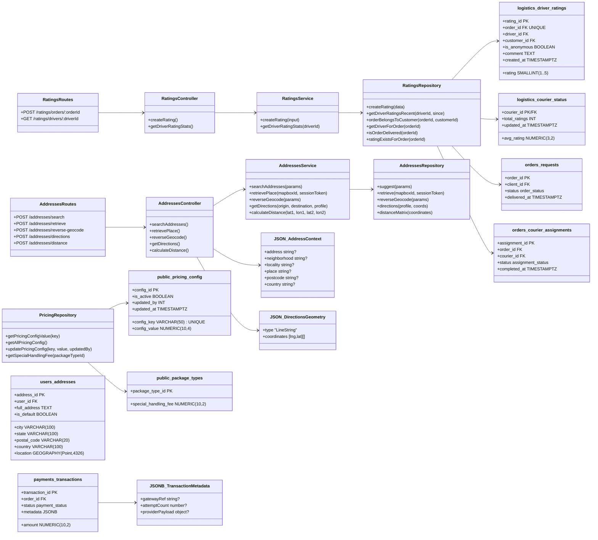

# Addresses, Pricing, Ratings UML (with JSON/JSONB)

```mermaid
classDiagram
  direction LR

  class AddressesRoutes {
    +POST /addresses/search
    +POST /addresses/retrieve
    +POST /addresses/reverse-geocode
    +POST /addresses/directions
    +POST /addresses/distance
  }

  class AddressesController {
    +searchAddresses()
    +retrievePlace()
    +reverseGeocode()
    +getDirections()
    +calculateDistance()
  }

  class AddressesService {
    +searchAddresses(params)
    +retrievePlace(mapboxId, sessionToken)
    +reverseGeocode(params)
    +getDirections(origin, destination, profile)
    +calculateDistance(lat1, lon1, lat2, lon2)
  }

  class AddressesRepository {
    +suggest(params)
    +retrieve(mapboxId, sessionToken)
    +reverseGeocode(params)
    +directions(profile, coords)
    +distanceMatrix(coordinates)
  }

  class RatingsRoutes {
    +POST /ratings/orders/:orderId
    +GET /ratings/drivers/:driverId
  }

  class RatingsController {
    +createRating()
    +getDriverRatingStats()
  }

  class RatingsService {
    +createRating(input)
    +getDriverRatingStats(driverId)
  }

  class RatingsRepository {
    +createRating(data)
    +getDriverRatingsRecent(driverId, since)
    +orderBelongsToCustomer(orderId, customerId)
    +getDriverForOrder(orderId)
    +isOrderDelivered(orderId)
    +ratingExistsForOrder(orderId)
  }

  class PricingRepository {
    +getPricingConfigValue(key)
    +getAllPricingConfig()
    +updatePricingConfig(key, value, updatedBy)
    +getSpecialHandlingFee(packageTypeId)
  }

  class users_addresses {
    +address_id PK
    +user_id FK
    +full_address TEXT
    +city VARCHAR(100)
    +state VARCHAR(100)
    +postal_code VARCHAR(20)
    +country VARCHAR(100)
    +location GEOGRAPHY(Point,4326)
    +is_default BOOLEAN
  }

  class logistics_driver_ratings {
    +rating_id PK
    +order_id FK UNIQUE
    +driver_id FK
    +customer_id FK
    +rating SMALLINT (1..5)
    +is_anonymous BOOLEAN
    +comment TEXT
    +created_at TIMESTAMPTZ
  }

  class logistics_courier_status {
    +courier_id PK/FK
    +avg_rating NUMERIC(3,2)
    +total_ratings INT
    +updated_at TIMESTAMPTZ
  }

  class orders_requests {
    +order_id PK
    +client_id FK
    +status order_status
    +delivered_at TIMESTAMPTZ
  }

  class orders_courier_assignments {
    +assignment_id PK
    +order_id FK
    +courier_id FK
    +status assignment_status
    +completed_at TIMESTAMPTZ
  }

  class public_pricing_config {
    +config_id PK
    +config_key VARCHAR(50) UNIQUE
    +config_value NUMERIC(10,4)
    +is_active BOOLEAN
    +updated_by INT
    +updated_at TIMESTAMPTZ
  }

  class public_package_types {
    +package_type_id PK
    +special_handling_fee NUMERIC(10,2)
  }

  class payments_transactions {
    +transaction_id PK
    +order_id FK
    +status payment_status
    +amount NUMERIC(10,2)
    +metadata JSONB
  }

  class JSON_AddressContext {
    +address string?
    +neighborhood string?
    +locality string?
    +place string?
    +postcode string?
    +country string?
  }

  class JSON_DirectionsGeometry {
    +type "LineString"
    +coordinates [lng,lat][]
  }

  class JSONB_TransactionMetadata {
    +gatewayRef string?
    +attemptCount number?
    +providerPayload object?
  }

  AddressesRoutes --> AddressesController
  AddressesController --> AddressesService
  AddressesService --> AddressesRepository

  RatingsRoutes --> RatingsController
  RatingsController --> RatingsService
  RatingsService --> RatingsRepository

  RatingsRepository --> logistics_driver_ratings
  RatingsRepository --> logistics_courier_status
  RatingsRepository --> orders_requests
  RatingsRepository --> orders_courier_assignments

  PricingRepository --> public_pricing_config
  PricingRepository --> public_package_types

  AddressesController --> JSON_AddressContext
  AddressesController --> JSON_DirectionsGeometry
  payments_transactions --> JSONB_TransactionMetadata
```
