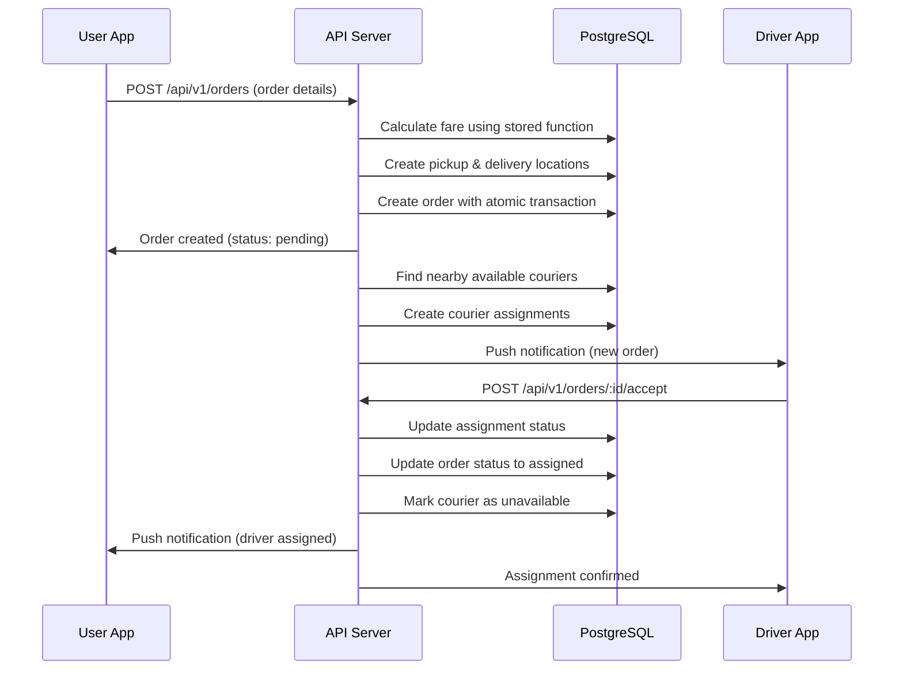
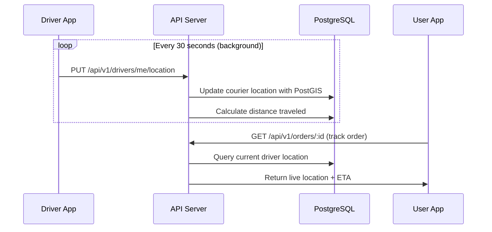

# 🏗️ Shipzy System Architecture

> Comprehensive system design for the hyperlocal delivery platform

---

## 📋 System Overview

Shipzy is a **production-grade hyperlocal delivery platform** that connects customers with nearby couriers for instant deliveries. The system handles real-time order matching, live tracking, secure payments, and comprehensive analytics.

### 🎯 Core Capabilities

- **Real-time Order Matching**: Geospatial courier assignment with PostGIS
- **Live GPS Tracking**: Continuous location updates and route optimization
- **Multi-modal Payments**: COD, UPI, Card payments with secure processing
- **Firebase Authentication**: Phone number verification with OTP
- **Cross-platform Apps**: iOS/Android Flutter applications
- **Advanced Analytics**: Earnings tracking, performance metrics, and reporting

---

## 🏛️ Architecture Components

### 📱 Frontend Applications

#### **User App** (`apps/user/`)

- **Framework**: Flutter 3.0+ with Dart 3.9+
- **State Management**: Riverpod (reactive, dependency injection)
- **Networking**: Dio HTTP client with interceptors
- **Local Storage**: ObjectBox for offline data persistence
- **Maps**: Mapbox integration for location services
- **Authentication**: Firebase Auth + JWT tokens

**Key Features**:

- 📍 Real-time order booking with location selection
- 🗺️ Interactive maps with pickup/delivery visualization
- 💳 Multiple payment methods (COD, UPI, Cards)
- 📱 Push notifications via Firebase Cloud Messaging
- 🌙 Dark mode support with automatic theming
- 📊 Order history and tracking

#### **Driver App** (`apps/driver/`)

- **Framework**: Flutter 3.0+ (in development)
- **Architecture**: Feature-first with clean architecture
- **Real-time Tracking**: Background GPS location updates
- **Offline Support**: Local data persistence for reliability

**Planned Features**:

- 🚛 Real-time order acceptance/rejection
- 📍 Continuous GPS tracking with battery optimization
- 💰 Earnings dashboard with performance metrics
- 🗺️ Route optimization and turn-by-turn navigation
- 📷 Proof of delivery with photo capture
- ⭐ Customer ratings and feedback system

### 🔧 Backend Services

#### **API Server** (`services/backend/`)

- **Framework**: Fastify 4.28 (high-performance Node.js framework)
- **Runtime**: Node.js 18+ with ES modules
- **Authentication**: Firebase Auth + JWT with refresh tokens
- **Database**: PostgreSQL 14+ with PostGIS for geospatial operations
- **Validation**: AJV schema validation with custom middleware
- **Logging**: Pino structured logging with development/production modes

**Core Modules**:

- **Authentication**: Firebase phone auth, JWT management, session handling
- **User Management**: Profile management, address book, preferences
- **Order Management**: Complex order lifecycle with status transitions
- **Driver Management**: Courier availability, location tracking, assignments
- **Static Data**: Delivery types, pricing, vehicle categories, payment methods

#### **Database Architecture**

**PostgreSQL Schema Design**:

```
users/           # User profiles, addresses, auth sessions
logistics/       # Delivery types, locations, courier vehicles
orders/          # Order requests, assignments, proof of delivery
payments/        # Transactions, refunds, payment methods
tracking/        # Location history, route optimization
notifications/   # Push notifications, in-app messages
```

**Key Design Patterns**:

- **Soft Deletes**: All entities support soft deletion with `deleted_at`
- **Audit Trail**: Automatic timestamps with `created_at`, `updated_at`
- **Geospatial Indexing**: PostGIS geometry columns with spatial indexes
- **JSON Storage**: Flexible data storage for complex objects
- **Foreign Key Constraints**: Data integrity with cascade operations

**Performance Optimizations**:

- **Composite Indexes**: Multi-column indexes for common query patterns
- **Partial Indexes**: Conditional indexes for active records only
- **Geospatial Queries**: Efficient location-based searches with PostGIS
- **Connection Pooling**: pg.Pool with configurable limits and timeouts

### 🗄️ Data Flow & Business Logic

#### **Order Creation & Matching Flow**



#### **Real-time Tracking Flow**



### 🔒 Security Architecture

#### **Authentication & Authorization**

- **Firebase Phone Auth**: OTP-based secure authentication
- **JWT Tokens**: Short-lived access tokens (7 days) + refresh tokens (30 days)
- **Role-Based Access**: Client, Courier, Admin roles with granular permissions
- **Session Management**: Token blacklisting and device tracking
- **Rate Limiting**: Configurable limits per endpoint with Redis support

#### **Data Protection**

- **Encryption**: Sensitive data encrypted at rest and in transit
- **API Security**: HTTPS-only, CORS configuration, Helmet headers
- **Input Validation**: AJV schema validation with sanitization
- **SQL Injection Prevention**: Parameterized queries with pg library

#### **Privacy & Compliance**

- **Location Data**: User consent required, data minimization
- **Payment Security**: PCI DSS compliant payment processing
- **GDPR Compliance**: Data portability, right to erasure
- **Audit Logging**: Comprehensive activity logging

### 📊 Analytics & Monitoring

#### **Business Metrics**

- **Order Analytics**: Conversion rates, average order value, completion times
- **Driver Performance**: Acceptance rates, completion rates, customer ratings
- **Revenue Tracking**: Earnings by driver, payment method distribution
- **Geographic Insights**: Popular pickup/delivery zones, demand patterns

#### **System Monitoring**

- **Application Metrics**: Response times, error rates, throughput
- **Database Performance**: Query execution times, connection pool usage
- **Infrastructure**: CPU/memory usage, disk space, network traffic
- **User Experience**: App crash reports, user session analytics

### 🚀 Scalability & Performance

#### **Horizontal Scaling**

- **Stateless API**: No server-side sessions, easy horizontal scaling
- **Database Sharding**: Potential for geographic or service-based partitioning
- **CDN Integration**: Static assets served via Cloudflare/AWS CloudFront
- **Load Balancing**: Nginx upstream configuration for API instances

#### **Performance Optimizations**

- **Caching Strategy**: Redis for session data, API responses, and computed results
- **Database Optimization**: Query optimization, proper indexing, connection pooling
- **Background Processing**: Asynchronous tasks for notifications, analytics
- **CDN**: Static assets and API responses cached at edge locations

#### **High Availability**

- **Database Replication**: PostgreSQL streaming replication
- **Failover Strategy**: Automatic failover with health checks
- **Backup Strategy**: Automated daily backups with point-in-time recovery
- **Disaster Recovery**: Multi-region deployment capability

### 🛠️ Development & Deployment

#### **Development Environment**

- **Docker Compose**: Isolated development environment
- **Hot Reload**: Fast development with automatic code reloading
- **Database Seeding**: Realistic test data for development
- **API Testing**: Comprehensive test suite with Jest and Supertest

#### **CI/CD Pipeline**

- **GitHub Actions**: Automated testing, building, and deployment
- **Multi-Environment**: Development, staging, and production deployments
- **Automated Testing**: Unit, integration, and E2E tests
- **Security Scanning**: Dependency vulnerability checks

#### **Production Deployment**

- **Container Orchestration**: Docker with health checks and auto-restart
- **Reverse Proxy**: Nginx for load balancing and SSL termination
- **SSL/TLS**: Let's Encrypt certificates with auto-renewal
- **Monitoring**: Application logs, error tracking, and alerting

### 🔄 Future Enhancements

#### **Phase 2 Features**

- **WebSocket Integration**: Real-time communication for live tracking
- **AI/ML Matching**: Intelligent courier assignment algorithms
- **Route Optimization**: Advanced routing with traffic consideration
- **Bulk Orders**: Enterprise solutions for large deliveries
- **Integration APIs**: Third-party logistics provider connections

#### **Technical Improvements**

- **GraphQL API**: More flexible data fetching for mobile apps
- **Microservices**: Service decomposition for better scalability
- **Event-Driven Architecture**: Message queues for async processing
- **Advanced Caching**: Multi-layer caching strategy

---

## 📚 Related Documentation

- [API Documentation](api/swagger.yaml) - OpenAPI specification
- [Deployment Guide](deployment/production-guide.md) - Production setup
- [Backend README](../../services/backend/README.md) - API implementation details
- [User App README](../../apps/user/README.md) - Mobile app architecture

---

Built with ❤️ by the Shipzy engineering team.
