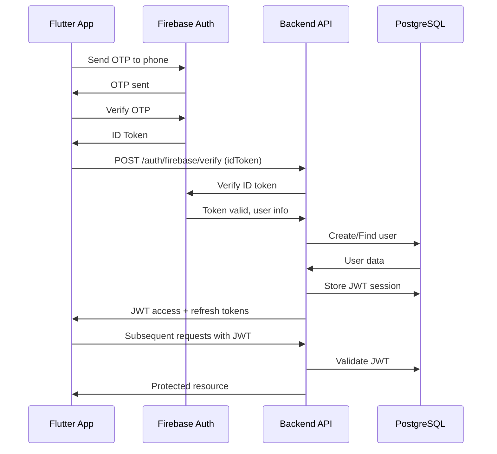

# 🚚 Shipzy Backend

> Production-ready backend API for the Shipzy hyperlocal delivery platform

[](https://nodejs.org/)
[](https://www.fastify.io/)
[](https://www.postgresql.org/)
[](https://firebase.google.com/)

---

## 📋 Overview

Shipzy Backend is a high-performance REST API built with Fastify, Firebase Authentication, and PostgreSQL. It powers a hyperlocal delivery platform connecting customers with nearby couriers.

### Key Features

- ✅ **Firebase Phone Authentication** (OTP-based)
- ✅ **JWT Token Management** with refresh tokens
- ✅ **Role-Based Access Control** (Client, Courier, Admin)
- ✅ **PostgreSQL Database** with PostGIS for geospatial queries
- ✅ **Real-time Tracking** (WebSocket support ready)
- ✅ **Secure & Scalable** architecture
- ✅ **Comprehensive Error Handling**
- ✅ **Rate Limiting** & Security Headers
- ✅ **Structured Logging** with Pino

---

## 🚀 Quick Start

### Prerequisites

- Node.js >= 18.0.0
- PostgreSQL 14+
- Firebase project
- npm or yarn

### Installation

```bash
# 1. Clone and navigate
cd services/backend

# 2. Install dependencies
npm install

# 3. Configure environment
cp .env.example .env
# Edit .env with your credentials

# 4. Setup database
psql -U postgres -f src/database/init/schema.sql

# 5. Start server
npm run dev
```

**👉 See [QUICKSTART.md](./QUICKSTART.md) for detailed setup**

**👉 See [FIREBASE_AUTH_SETUP.md](./FIREBASE_AUTH_SETUP.md) for Firebase configuration**

---

## 📂 Project Structure

```
services/backend/
├── src/
│   ├── config/                 # Configuration
│   │   ├── env.js             # Environment variables
│   │   ├── firebase.js        # Firebase Admin SDK
│   │   └── logger.js          # Pino logger
│   │
│   ├── utils/                  # Utilities
│   │   ├── jwt.util.js        # JWT generation/verification
│   │   ├── response.util.js   # Standard responses
│   │   └── error.util.js      # Custom error classes
│   │
│   ├── middleware/             # Middleware
│   │   ├── auth.middleware.js # JWT authentication
│   │   ├── error.middleware.js# Global error handler
│   │   └── validate.middleware.js # Request validation
│   │
│   ├── database/               # Database
│   │   ├── db.js              # Connection pool
│   │   ├── transaction.js     # Transaction helper
│   │   ├── init/              # Schema & migrations
│   │   └── queries/           # SQL queries
│   │       ├── auth.queries.js
│   │       ├── orders.queries.js
│   │       ├── drivers.queries.js
│   │       └── ...
│   │
│   ├── modules/                # Feature modules
│   │   └── auth/              # Authentication module
│   │       ├── auth.routes.js    # Routes
│   │       ├── auth.controller.js # Controllers
│   │       ├── auth.service.js   # Business logic
│   │       ├── auth.repository.js # Data access
│   │       └── auth.schema.js    # Validation schemas
│   │
│   ├── app.js                  # Fastify app
│   └── server.js               # Server entry point
│
├── package.json
├── .env.example
├── QUICKSTART.md
├── FIREBASE_AUTH_SETUP.md
└── README.md
```

---

## 🛠️ Tech Stack

| Category | Technology |
|----------|-----------|
| **Runtime** | Node.js 18+ |
| **Framework** | Fastify 4.28 |
| **Database** | PostgreSQL 14+ with PostGIS |
| **Authentication** | Firebase Auth + JWT |
| **Logger** | Pino |
| **Validation** | AJV |
| **Security** | Helmet, CORS, Rate Limiting |

---

## 📡 API Endpoints

### Authentication

| Method | Endpoint | Description | Auth Required |
|--------|----------|-------------|---------------|
| POST | `/api/v1/auth/firebase/verify` | Login/Register with Firebase | No |
| POST | `/api/v1/auth/refresh` | Refresh JWT token | No |
| POST | `/api/v1/auth/logout` | Logout (revoke token) | Yes |

### Health Check

| Method | Endpoint | Description | Auth Required |
|--------|----------|-------------|---------------|
| GET | `/health` | Server health status | No |

**More endpoints** (orders, tracking, payments) coming soon...

---

## 🔐 Authentication Flow



---

## 🔧 Environment Variables

| Variable | Description | Example |
|----------|-------------|---------|
| `NODE_ENV` | Environment | `development` |
| `PORT` | Server port | `3000` |
| `DB_HOST` | Database host | `localhost` |
| `DB_NAME` | Database name | `shipzy_dev` |
| `DB_USER` | Database user | `shipzy_user` |
| `DB_PASSWORD` | Database password | `secure_password` |
| `JWT_SECRET` | JWT signing key | (generate with openssl) |
| `FIREBASE_PROJECT_ID` | Firebase project ID | From Firebase Console |
| `FIREBASE_CLIENT_EMAIL` | Firebase service account | From Firebase Console |
| `FIREBASE_PRIVATE_KEY` | Firebase private key | From Firebase Console |

**See [.env.example](./.env.example) for complete list**

---

## 🧪 Development

### Available Scripts

```bash
# Development with auto-reload
npm run dev

# Production
npm start

# Linting
npm run lint
npm run lint:fix

# Format code
npm run format

# Database migrations
npm run migrate

# Seed database
npm run seed
```

---

## 🚢 Production Deployment

### Option 1: Docker

```bash
docker compose -f docker compose.yml up -d
```

### Option 2: PM2

```bash
npm install -g pm2
pm2 start src/server.js --name shipzy-backend
pm2 startup
pm2 save
```

### Option 3: Systemd

```bash
sudo systemctl start shipzy-backend
sudo systemctl enable shipzy-backend
```

**See [production-guide.md](../../docs/deployment/production-guide.md) for details**

---

## 🔒 Security Best Practices

- ✅ Environment variables for secrets
- ✅ JWT with short expiration (7 days)
- ✅ Refresh tokens for long sessions
- ✅ Rate limiting (100 req/min by default)
- ✅ CORS configured
- ✅ Helmet security headers
- ✅ SQL injection prevention (parameterized queries)
- ✅ Token revocation on logout
- ✅ HTTPS only in production

---

## 🐛 Troubleshooting

### Database Connection Issues

```bash
# Check PostgreSQL is running
sudo systemctl status postgresql

# Test connection
psql -U shipzy_user -d shipzy_dev -c "SELECT NOW();"
```

### Firebase Auth Issues

```bash
# Verify credentials
node -e "console.log(require('firebase-admin').credential.cert(JSON.parse(process.env.FIREBASE_PRIVATE_KEY)))"
```

### Port Already in Use

```bash
# Find process using port 3000
lsof -i :3000

# Kill process
kill -9 <PID>
```

---

## 📚 Documentation

- [Quick Start Guide](./QUICKSTART.md)
- [Firebase Auth Setup](./FIREBASE_AUTH_SETUP.md)
- [Database Schema](./src/database/init/schema.sql)
- [API Documentation](../../docs/api/swagger.yaml) (coming soon)
- [Architecture](../../docs/architecture/system-design.md)

---

## 🤝 Contributing

1. Create feature branch: `git checkout -b feature/your-feature`
2. Commit changes: `git commit -m "Add feature"`
3. Push: `git push origin feature/your-feature`
4. Create Pull Request

---

## 📄 License

See [LICENSE](../../LICENSE)

---

## 📞 Support

- **Issues**: Create an issue on GitHub
- **Email**: support@shipzy.com
- **Docs**: See documentation links above

---

**Built with ❤️ by the Shipzy Team**
